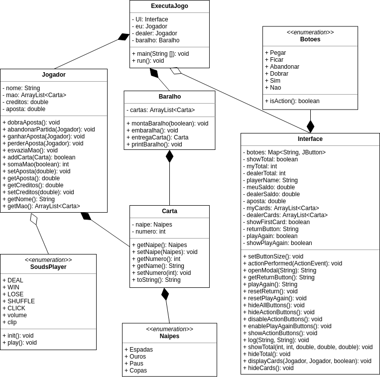

# BlackjackJava
# Projeto para Programação Orientada a Objetos - 2019-1
## Autor: Camilo Esteves Mendes de Avelar - 13.2.1482

### Diagrama UML



### Explicação do projeto e suas estruturas

- Classes
  - Carta
  - Jogador
  - Baralho
  - ExecutaJogo
  - Interface
  - Message
 - ENUMs
   - Naipes
   - Botoes
   - SoundsPlayer

### Implementação
- Este projeto foi implementado em duas etapas:
  - 1a. Sem interface: 
    - Implementação sem interface, mostrando as cartas e as opções no console,
    com esta implementação pronta, parti para a próxima implementação
    - Podemos ver esta implementação no seguinte commit: [71783ae9d9e20aab87f18a7799dfec04b191cd62](https://github.com/CamiloAvelar/BlackjackJava/commits/71783ae9d9e20aab87f18a7799dfec04b191cd62)
    - Nela podemos ver as classes utilizadas na lógica principal sem a utilização de interfaces.
  - 2a. Criação da interface:
    - Implementação e adaptação do programa à interface.
    
### Explicação de trechos importantes do código

- Criação do baralho:
```Java
    public void montaBaralho(boolean embaralhar) {
        if(!this.cartas.isEmpty()) {
            cartas.clear();
        }

        for(int naipe = 0; naipe < 4; naipe++){

            for(int numero = 1; numero <= 13; numero++) {
                this.cartas.add(new Carta(Naipes.values()[naipe], numero));
            }
        }

        if (embaralhar) {
            this.embaralha();
        }
    }

```

Realiza dois loopings, um que percorre os naipes, outro percorrendo o número das cartas.

- Entrega das cartas:
```Java
    public Carta entregaCarta() {
        Carta topo = this.cartas.get(0);

        this.cartas.remove(0);
        SoundsPlayer.DEAL.play();
        return topo;
    }
```

Retorna a primeira carta do baralho, removendo-a do array.

- Validação dos números das cartas:
```Java
    public Carta(Naipes naipe, int numero) {
        this.naipe = naipe;

        if(numero >= 1 && numero <= 13) {
            this.numero = numero;
        } else {
            System.err.println(numero + " não é uma Carta válida!");
            System.exit(1);
        }
    }

```

Valida se a carta tem um número válido

- Adicionar carta à mão do jogador
```Java
    public boolean addCarta(Carta carta) {
        this.mao.add(carta);

        return (this.somaMao(true) <= 21);
    }
```

Adiciona a carta e retorna um boolean avisando se a mão tem mais de 21 pontos

- Tratamento da soma da mão do jogador, verificando o valor do As:
```Java
    public int somaMao(boolean somaPrimeiraCarta) {
        int somaMao = 0;
        int numeroCarta;
        int numeroAs = 0;

        int cont = 0;
        for(Carta c : mao) {
            numeroCarta = c.getNumero();

            if(!somaPrimeiraCarta && cont == 0) {
                numeroCarta = 0;
            }

            if(numeroCarta == 1) {
                numeroAs++;
                somaMao += 11;
            } else if (numeroCarta > 10) {
                somaMao += 10;
            } else {
                somaMao += numeroCarta;
            }

            cont++;
        }

        while (somaMao > 21 && numeroAs > 0) {
            somaMao -= 10;
            numeroAs--;
        }


        return somaMao;
    }
```

Recebe um boolean como parametro, se for false, não soma a primeira carta (para uso na mão do dealer).
Percorre todas as cartas da mão do jogador, pega o número da carta, se for 1, significa que é um As, soma um contador auxiliar e adiciona 11 no somatório final, se a carta for maior que 10, soma 10 no somatório final, se for uma carta de 2 a 10, soma o valor da carta.

Caso a soma da mão for maior que 21 e o contador auxiliar for maior que 0, ele diminui 10 do somatório final até o somatório for menor que 21 ou o numero de As acabar(contador auxiliar zerar).

- Ganhar ou perder uma aposta
```Java
    public void ganharAposta(Jogador perdedor) {
        this.creditos += this.aposta;
        perdedor.setCreditos(perdedor.getCreditos() - this.aposta);
    }
```

Soma o valor da aposta nos creditos do jogador ganhador, e retira a quantidade da aposta do saldo do jogador perdedor. Perder uma aposta realiza o contrário, retira a aposta do saldo e coloca na mão do ganhador.

- Espera pela ação do usuário:
```Java
            while ((!euAcabei || !dealerAcabou)) {
              ...
                if(!euAcabei) {
                    UI.enableActionButtons();
                    switch (UI.getReturnButton()) {
                        case "pegar":
                            euAcabei = !eu.addCarta(baralho.entregaCarta());
                            UI.log("Você pegou uma carta!", eu.getNome());
                            break;
                        case "ficar":
                            euAcabei = true;
                            UI.log("Você decidiu ficar!", eu.getNome());
                            break;
                        case "abandonar":
                            eu.abandonarPartida(dealer);
                            UI.log("Você desistiu!", eu.getNome());
                            abandonGame = true;
                            break;
                        case "dobrar":
                            eu.dobraAposta();
                            euAcabei = !eu.addCarta(baralho.entregaCarta());
                            UI.log("Você dobrou a aposta e pegou mais uma carta!", eu.getNome());
                            break;
                        default:
                            try {
                                Thread.sleep(10);
                            } catch (InterruptedException e) {
                                e.printStackTrace();
                            }
                            continue;
                    }
                    ...
              }
```

Este loop acontece até que os dois jogadores (player e dealer) não terminarem, o que define se eles terminaram ou não é o retorno do addCarta, que retorna true se a soma das cartas for maior que 21.
Outro modo de terminar antes é se o player decidir ficar e o dealer também.
O UI.getReturnButton retorna a String correspondente ao botão apertado, que deve ser "Pegar", "Ficar", "Abandonar" ou "Dobrar", caso não for nenhuma delas, a Thread dorme por 10ms para evitar consumo excessivo da CPU e espera pelo input.

```Java
    public void actionPerformed(ActionEvent e) {
        if(e.getSource() == botoes.get("Pegar")) {
            Interface.returnButton = "pegar";
        }

        if(e.getSource() == botoes.get("Ficar")) {
            SoundsPlayer.CLICK.play();
            Interface.returnButton = "ficar";
        }

        if(e.getSource() == botoes.get("Abandonar")) {
            SoundsPlayer.CLICK.play();
            Interface.returnButton = "abandonar";
        }

        if(e.getSource() == botoes.get("Dobrar")) {
            Interface.returnButton = "dobrar";
        }

        if(e.getSource() == botoes.get("Sim")) {
            SoundsPlayer.CLICK.play();
            Log.clear();
            Interface.playAgain = "S";
            repaint();
        }

        if(e.getSource() == botoes.get("Nao")) {
            SoundsPlayer.CLICK.play();
            Interface.playAgain = "N";
        }
    }
```

Tratamento dos botões na interface, define o retorno da função UI.getReturnButton na main.

- Ações tomadas em relação ao ganhador:
```Java
                if (minhaSoma > somaDealer && minhaSoma <= 21 || somaDealer > 21) {
                    eu.ganharAposta(dealer);
                    UI.log("Você ganhou!", eu.getNome());
                    SoundsPlayer.WIN.play();
                } else if (minhaSoma == somaDealer) {
                    eu.setAposta(0);
                    UI.log("Empatou", "");
                } else {
                    eu.perderAposta(dealer);
                    UI.log("Dealer ganhou!", dealer.getNome());
                    SoundsPlayer.LOSE.play();
                }
```
Caso a minhasoma for maior que a soma do dealer e menor ou igual à 21, o jogador ganhará.
Caso a soma do dealer for maior que 21, o jogador ganhará.
Caso as somas forem iguais, acontecerá o empate, os saldos não mudarão.
Caso nenhuma destas condições acontecer, o dealer ganhará.

Ao ganhar ou perder, um som é executado.

- Desenho das cartas no Board:
```Java
        private void drawCards(Graphics g, Carta c, int i, boolean isDealer) {
            int dealerSpacing;
            if (isDealer) {
                dealerSpacing = 200;
            } else {
                dealerSpacing = 0;
            }

            if(isDealer && i == 0 && !Interface.showFirstCard) {
                g.setColor(Color.black);
            } else {
                g.setColor(Color.white);
            }
            g.fillRect(gridX+spacing+tCardW*i+rounding, gridY+spacing+dealerSpacing, cardW-rounding*2, cardH);
            g.fillRect(gridX+spacing+tCardW*i, gridY+spacing+rounding+dealerSpacing, cardW, cardH-rounding*2);
            g.fillOval(gridX+spacing+tCardW*i, gridY+spacing+dealerSpacing, rounding*2, rounding*2);
            g.fillOval(gridX+spacing+tCardW*i, gridY+spacing+cardH-rounding*2+dealerSpacing, rounding*2, rounding*2);
            g.fillOval(gridX+spacing+tCardW*i+cardW-rounding*2, gridY+spacing+dealerSpacing, rounding*2, rounding*2);
            g.fillOval(gridX+spacing+tCardW*i+cardW-rounding*2, gridY+spacing+cardH-rounding*2+dealerSpacing, rounding*2, rounding*2);
            if(!(isDealer && i == 0) || Interface.showFirstCard) {
                g.setFont(fontCard);
                if (c.getNaipe().toString().equalsIgnoreCase("Copas") || c.getNaipe().toString().equalsIgnoreCase("Ouros")) {
                    g.setColor(Color.red);
                } else {
                    g.setColor(Color.black);
                }

                g.drawString(c.getName(), gridX+spacing+tCardW*i+rounding, gridY+spacing+cardH-rounding+dealerSpacing);

                if (c.getNaipe().toString().equalsIgnoreCase("Copas")) {
                    g.fillOval(gridX+tCardW*i+42, gridY+70+dealerSpacing, 35, 35);
                    g.fillOval(gridX+tCardW*i+73, gridY+70+dealerSpacing, 35, 35);
                    g.fillArc(gridX+tCardW*i+30, gridY+90+dealerSpacing, 90, 90, 51, 78);
                } else if (c.getNaipe().toString().equalsIgnoreCase("Ouros")) {
                    polyX[0] = gridX+tCardW*i+75;
                    polyX[1] = gridX+tCardW*i+50;
                    polyX[2] = gridX+tCardW*i+75;
                    polyX[3] = gridX+tCardW*i+100;
                    polyY[0] = gridY+60+dealerSpacing;
                    polyY[1] = gridY+100+dealerSpacing;
                    polyY[2] = gridY+140+dealerSpacing;
                    polyY[3] = gridY+100+dealerSpacing;
                    g.fillPolygon(polyX, polyY, 4);
                } else if (c.getNaipe().toString().equalsIgnoreCase("Espadas")) {
                    g.fillOval(gridX+tCardW*i+42, gridY+90+dealerSpacing, 35, 35);
                    g.fillOval(gridX+tCardW*i+73, gridY+90+dealerSpacing, 35, 35);
                    g.fillArc(gridX+tCardW*i+30, gridY+15+dealerSpacing, 90, 90, 51+180, 78);
                    g.fillRect(gridX+tCardW*i+70, gridY+100+dealerSpacing, 10, 40);
                } else {
                    g.fillOval(gridX+tCardW*i+40, gridY+90+dealerSpacing, 35, 35);
                    g.fillOval(gridX+tCardW*i+75, gridY+90+dealerSpacing, 35, 35);
                    g.fillOval(gridX+tCardW*i+58, gridY+62+dealerSpacing, 35, 35);
                    g.fillRect(gridX+tCardW*i+70, gridY+75+dealerSpacing, 10, 70);
                }
            }
        }
```
As cartas são desenhadas utilizando funções do próprio Swing, esta função contem as informações das formas das cartas, ela recebe a carta a ser desenhada e lê as informações necessárias para desenhar (número e naipe). Recebe também um boolean falando se é ou não dealer, caso for, a primeira carta fica oculta até o jogo terminar.
